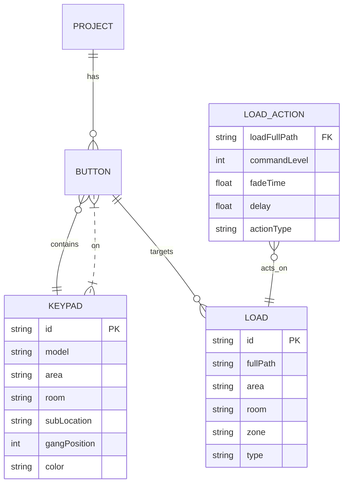
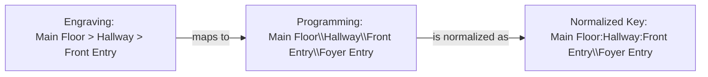
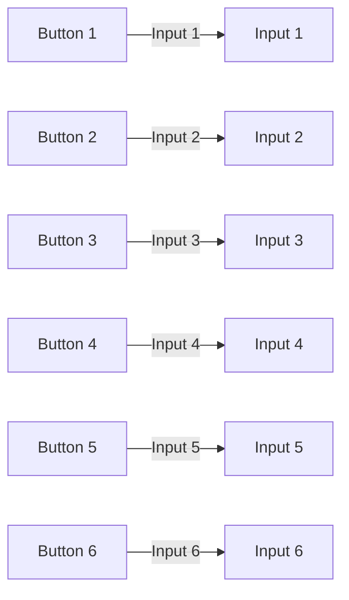
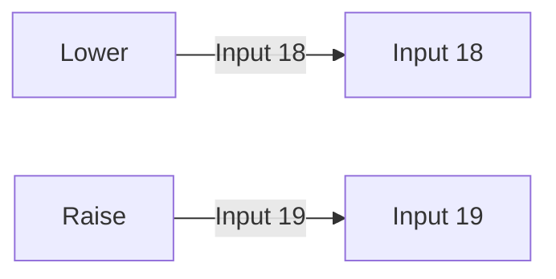

# Lutron HomeWorks Data Model

## Entity Relationship Diagram



---

## Data Sources

### Engraving Report

- **Purpose**: Physical layout of keypads
- **Key Data**:
  - Location: `Floor > Room > SwitchName` (uses `>`)
  - Model: `RKD-H6BRL-BL-E` (keypad type)
  - Wallplate: Gang position, color
  - Faceplate: Optional label
  - Button labels: Text engraved on each button (1-6)

### Programming Report

- **Purpose**: Button logic and actions
- **Key Data**:
  - Area Path: `Floor\Room\SwitchName` (uses `\`)
    - **Important**: SwitchName is everything after 2nd backslash
    - Example: `Main Floor\Hallway\Front Entry\Foyer Entry`
      - Floor: `Main Floor`
      - Room: `Hallway`
      - SwitchName: `Front Entry\Foyer Entry`
  - Input Number: 1-19 (1-6 for buttons, 18-19 for raise/lower)
  - LED Logic: `Scene`, `Room`, or `Defined by local load`
  - Type: `Toggle` or `Single Action`
  - Actions (differ by button type):
    - **Single Action**: `Press`, `Release`, `Double Tap`, `Hold`
    - **Toggle**: `Press On`, `Off Level`
  - Action Tables with columns:<br>
    &nbsp;&nbsp;• Assignable Item Type: Always "Lighting - Zones"<br>
    &nbsp;&nbsp;• Item Description/Area Path: `Floor>Room>Zone` (uses `>`)<br>
    &nbsp;&nbsp;• Command/Level: `75%` (dimmer level)<br>
    &nbsp;&nbsp;• Fade: `2 s` (transition time)<br>
    &nbsp;&nbsp;• Delay: `0 s` (delay before action starts)

---

## Button Actions Data Model

### Single Action Buttons
Use physical interaction types:
```typescript
interface ButtonActions {
  press?: LoadAction[];      // When button is pressed
  release?: LoadAction[];    // When button is released
  doubleTap?: LoadAction[];  // When button is double-tapped
  hold?: LoadAction[];       // When button is held down
}
```

### Toggle Buttons
Use state-based types:
```typescript
interface ButtonActions {
  on?: LoadAction[];   // When button toggles to ON state
  off?: LoadAction[];  // When button toggles to OFF state
}
```

Example:
- Button 3 (Mudroom - Toggle):
  - `on`: Mudroom → 85%
  - `off`: Mudroom → 0%

---

## Key Mappings

### Location Mapping (Engraving → Programming)



### Button Mapping



### Raise/Lower Buttons (Hybrid models only)



---

## Parser Fixes Needed

1. **Area Path Splitting**: Split on first 2 backslashes only, treat rest as switch name
2. **Action Tables**: Parse each action type separately (Press, Double Tap, etc.)
3. **Load Paths**: Convert `>` to `:` for consistency
4. **Keypad Sections**: Split programming report by "Area Path:" markers
5. **Key Generation**: Use normalized format `Floor:Room:SwitchName_gX_input-Y`

---

## Example Data Flow

**Engraving Report:**
```text
Main Floor > Hallway > Front Entry
Wallplate: CW-1-BL-E
Model: RKD-H6BRL-BL-E
Button 1: "Welcome"
Button 2: "Soffit LED"
...
```

**Programming Report:**
```text
Area Path: Main Floor\Hallway\Front Entry\Foyer Entry
Gang Position: 1
Input Number: 1  LED Logic: Scene  Type: Single Action  Action: Press
  Lighting - Zones  Main Floor>Hallway>Mudroom  75%  2 s  0 s
  Lighting - Zones  Main Floor>Kitchen>North Track  75%  2 s  0 s
```

**Merged Keypad:**
```json
{
  "id": "main-floor_hallway_front-entry\\foyer-entry_g1",
  "location": {
    "area": "Main Floor",
    "room": "Hallway",
    "subLocation": "Front Entry"
  },
  "buttons": [
    {
      "position": 1,
      "inputNumber": 1,
      "engraving": { "label": "Welcome" },
      "logic": {
        "type": "single-action",
        "ledLogic": { "type": "scene" },
        "actions": {
          "press": [
            {
              "loadFullPath": "Main Floor:Hallway:Mudroom",
              "commandLevel": 75,
              "fadeTime": 2,
              "delay": 0
            }
          ]
        }
      }
    }
  ]
}
```

---

> **Tip:** You can view Mermaid diagrams live in many GitHub Markdown preview tools and extensions.
